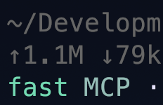

# Codex Fast Mode for Pi

Tiny Pi extension that puts OpenAI Codex on the fast lane.

Codex's Fast button is just this request field:

```json
{ "service_tier": "priority" }
```

This wraps Pi's `openai-codex-responses` provider and adds that field when you ask for it. The footer stays quiet unless fast is actually armed:



This is purely vibecoded. I read Codex source, made the smallest shim, then added tests so the vibe has guardrails. It can change routing and billing. Don't turn it on if you don't want priority-tier behavior.

## Install

```bash
pi install git:github.com/pro-vi/pi-codex-fast-mode
```

## Use

```text
/codex-fast on      auto mode for known fast Codex models
/codex-fast force   priority for any openai-codex-responses model
/codex-fast off
/codex-fast status
```

Startup:

```bash
pi --codex-fast
```

## Modes

`off` is default.

`auto` only targets `openai-codex` models Codex currently marks fast-capable: `gpt-5.4`, `gpt-5.5`.

`force` sends priority for any `openai-codex-responses` model.

## Cost accounting

I don't patch usage cost here. Pi already does that in the Codex provider.

Proof from `@earendil-works/pi-ai@0.74.0/dist/providers/openai-codex-responses.js`:

```js
if (options?.serviceTier !== undefined) {
  body.service_tier = options.serviceTier;
}

processResponsesStream(..., {
  serviceTier: options?.serviceTier,
  applyServiceTierPricing: (usage, serviceTier) =>
    applyServiceTierPricing(usage, serviceTier, model),
});

case "priority":
  return model.id === "gpt-5.5" ? 2.5 : 2;
```

So the extension should not touch `message.usage.cost`. OpenAI dashboard is still the billing truth.

## Dev

```bash
npm install
npm run check
```

It does not touch normal `openai-responses` models. It does override Pi's `openai-codex-responses` handler for the session, so don't load another wrapper for that same API unless you like adapter cage fights.
